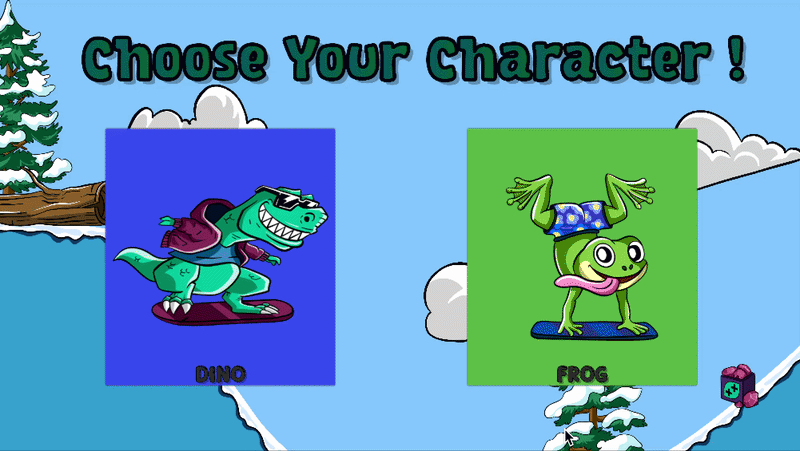
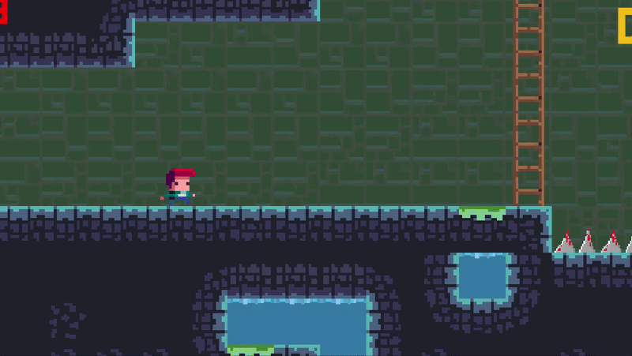

# Mini 2D Games (Unity)

This repository contains three small 2D game prototypes developed with Unity and C#.

## Games

### DeliveryDash
A simple delivery and collection game where the player drives a vehicle, collects ice cream, and delivers it to monsters.

### SnowSurfer
A score-based game where the player performs tricks to earn points.

### TileMania
A small platformer game with three levels and simple animations.

## Technologies
- Unity
- C#
